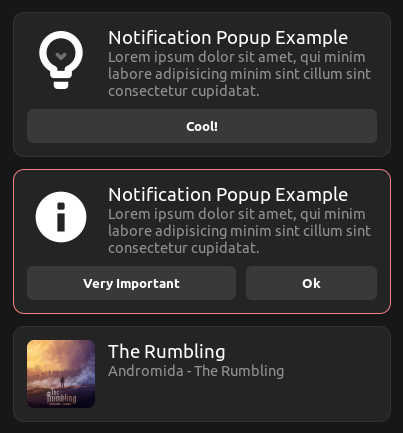
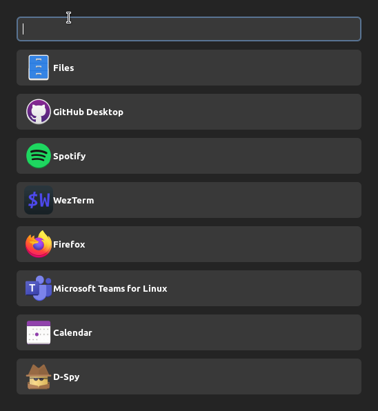

:::note
The examples below assumes you have [adw-gtk3](https://github.com/lassekongo83/adw-gtk3)
set as your GTK3 theme
:::

## [Simple Bar example](https://github.com/Aylur/ags/tree/main/example/simple-bar)

## [Notification Popups](https://github.com/Aylur/ags/tree/main/example/notification-popups)

## [Application Launcher](https://github.com/Aylur/ags/tree/main/example/applauncher)

## [Media Widget](https://github.com/Aylur/ags/tree/main/example/media-widget)

